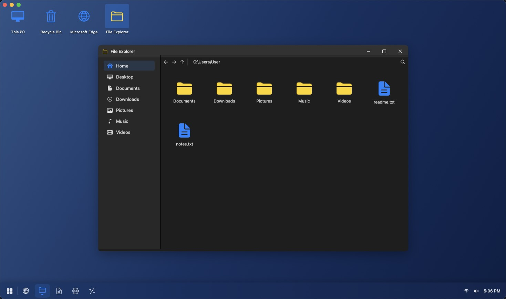

# Win11 Desktop Simulator

A native macOS application that simulates the Windows 11 desktop environment, built with SwiftUI.



**English** | [中文](README.zh-CN.md)

## Features

### Desktop Environment
- Windows 11 style desktop wallpaper
- Interactive desktop icons (double-click to open apps)
- Taskbar (Start button, app icons, time display)
- Start Menu (search box, pinned apps, power button)

### Window Management
- Draggable windows
- Minimize/Maximize/Close functionality
- Window shadows and rounded corners

### Built-in Apps

| App | Features |
|-----|----------|
| Microsoft Edge (Browser) | Web browsing, forward, back, refresh |
| File Explorer | Browse files and folders |
| Notepad | Text editing, file saving |
| Settings | Windows 11 style settings interface |
| Calculator | Full calculator functionality |

## Tech Stack

- **UI Framework**: SwiftUI + AppKit
- **Browser**: WKWebView (WebKit)
- **Build Tool**: XcodeGen

## Project Structure

```
win11-swift/
├── project.yml                    # XcodeGen configuration
├── Win11Desktop/
│   ├── App/
│   │   ├── Win11DesktopApp.swift  # App entry point
│   │   └── AppDelegate.swift       # App delegate
│   ├── Models/
│   │   ├── AppState.swift          # Global state management
│   │   └── DesktopIcon.swift       # Desktop icon model
│   ├── Views/
│   │   ├── Desktop/
│   │   │   ├── DesktopView.swift   # Desktop main view
│   │   │   └── DesktopIconView.swift
│   │   ├── Taskbar/
│   │   │   ├── TaskbarView.swift   # Taskbar
│   │   │   └── StartMenuView.swift # Start menu
│   │   ├── Windows/
│   │   │   └── DraggableWindow.swift # Draggable window
│   │   └── Apps/
│   │       ├── BrowserView.swift   # Browser
│   │       ├── ExplorerView.swift  # File Explorer
│   │       ├── NotepadView.swift   # Notepad
│   │       ├── SettingsView.swift  # Settings
│   │       └── CalculatorView.swift # Calculator
│   └── Resources/
│       └── Assets.xcassets         # App icons
```

## Quick Start

### Requirements
- macOS 13.0 or higher
- Xcode 15.0 or higher

### Build Steps

1. Clone the project and navigate to the directory:
   ```bash
   cd win11-swift
   ```

2. Generate the Xcode project with XcodeGen:
   ```bash
   xcodegen generate
   ```

3. Open the project in Xcode:
   ```bash
   open Win11Desktop.xcodeproj
   ```

4. Press `Cmd + R` to run the app

### Running Directly

The built app is located at:
```
~/Library/Developer/Xcode/DerivedData/Win11Desktop-*/Build/Products/Debug/Win11 Desktop.app
```

## Usage

1. **Open Apps**: Click the Start button or double-click desktop icons
2. **Switch Apps**: Click app icons on the taskbar
3. **Close Window**: Click the close button in the top-right corner
4. **Move Window**: Drag the window title bar
5. **Browser**: Enter a URL in the address bar and press Enter
6. **Notepad**: Click File -> Save to save files

## Notes

- Browser requires network connection to access websites
- Notepad save functionality opens the system save dialog
- The app runs in accessory mode as a desktop simulator

## License

MIT License
